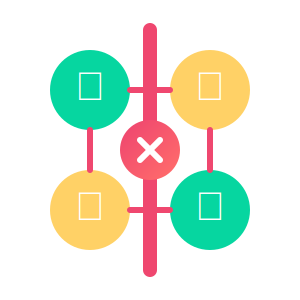

[](https://app.netlify.com/sites/kittypay/deploys)

# KittyPay - The Modern Desi Way to Split Expenses (V1.7)

<p align="center">
  
</p>

KittyPay is a sleek and smart expense-splitting app designed for groups of friends, flatmates, and families who love to hang out but hate the awkward math afterward. Inspired by the classic kitty party concept and built for the modern Indian user, KittyPay makes sharing expenses simple, fair, and even fun.

## 📱 Live Demo

Check out the live version at: [https://kittypay.netlify.app](https://kittypay.netlify.app)

## ✨ Key Features

### 💰 Expense Management
- **Smart Groups (Kitties)** - Create dedicated spaces for trips, flatmates, events, or regular hangouts
- **Flexible Splitting** - Split bills equally, by percentages, or custom amounts
- **Smart Settlements** - Minimize transactions with our optimized settlement algorithm
- **Multi-Currency Support** - Perfect for international trips and foreign expenses
- **Date Editing** - Retroactively adjust expense dates for accurate budgeting and tracking
- **Categories with Emojis** - Visual categorization making expense tracking more intuitive
- **Notes & Details** - Add context to expenses with detailed notes
- **Member Management** - Edit and remove members from kitties with proper owner controls
- **Expense Editing** - Full support for updating or deleting existing expenses

### 🧮 Financial Tools
- **Balance Dashboard** - Visual representation of your spending patterns
- **Monthly Trends** - Track spending increases/decreases over time
- **Category Breakdown** - See where your money is going with detailed charts
- **Top Spenders** - Identify who's contributing most to group expenses
- **Settlement Plans** - Optimized pathways to settle all debts with minimal transactions
- **Settlement Tracking** - Mark settlements as complete or pending with visual indicators

### 👥 Social Features
- **Activity Timeline** - Keep track of all group activity
- **In-app Reminders** - Gentle nudges for pending settlements
- **Multi-Member Support** - Add as many people as needed to your kitties
- **Owner Controls** - Designated kitty owner with management privileges

### 🎨 User Experience
- **Beautiful UI** - Clean, intuitive interface with smooth animations
- **Dark & Light Modes** - Easy on the eyes, day or night
- **Responsive Design** - Works flawlessly on all devices from mobile to desktop
- **Adaptive Layouts** - Optimized grid layouts for desktop with improved space utilization
- **Visual Feedback** - Context-aware toast notifications with appropriate icons
- **Backdrop Blur** - Modern glass-like effects for modals and overlays
- **Hidden Scrollbars** - Clean interface with functional scrolling without visual clutter

## 🔥 Firebase Integration

KittyPay seamlessly integrates with Firebase to provide a robust and scalable backend:

- **Authentication** - Secure user authentication with email/password and Google sign-in
- **Firestore Database** - Real-time data synchronization for kitties, expenses, and user profiles
- **Security Rules** - Fine-grained access control for protecting user data
- **Cloud Storage** - Store receipt images and profile pictures
- **Member Management** - Firebase functions for adding, editing, and removing kitty members
- **Google Analytics** - Track user engagement, feature usage, and app performance

## 🛠️ Tech Stack

- **Frontend**: 
  - React 18+
  - Tailwind CSS for styling
  - Framer Motion for animations
  - React Icons for UI elements
  - Recharts for data visualization
- **Build Tool**: Vite for fast development
- **Routing**: React Router v6 with protected routes
- **State Management**: React Context API & Hooks
- **Authentication**: Firebase Auth with multiple login options
- **Database**: Firebase Firestore
- **Analytics**: Firebase Google Analytics
- **Styling**: CSS Variables for theming, Tailwind for utilities
- **Deployment**: Netlify CI/CD pipeline

## 🚀 Getting Started

### Prerequisites
- Node.js 18+ 
- npm 9+ or yarn
- Firebase account (free tier works fine)

### Installation & Setup

```bash
# Clone the repository
git clone https://github.com/yourusername/kittypay.git

# Navigate to project directory
cd kittypay

# Install dependencies
npm install

# Configure environment variables
cp .env.example .env
# Then edit .env with your Firebase credentials

# Start development server
npm run dev
```

Visit `http://localhost:5173` to see the app in action!

### 🔥 Firebase Configuration

1. Create a new Firebase project at [firebase.google.com](https://firebase.google.com)
2. Enable Authentication (Email/Password and Google providers)
3. Create a Firestore database
4. Enable Google Analytics for your Firebase project
5. Add your Firebase configuration to `.env`
6. Deploy Firestore security rules (see [FIREBASE_SETUP.md](./FIREBASE_SETUP.md))

For detailed instructions, see [FIREBASE_SETUP.md](./FIREBASE_SETUP.md).

### 📊 Google Analytics Setup

KittyPay uses Firebase Google Analytics to track user engagement and app performance:

1. Enable Google Analytics in your Firebase project
2. Add your Measurement ID to `.env`:
   ```
   VITE_FIREBASE_MEASUREMENT_ID=your-measurement-id
   ```
3. Key metrics tracked:
   - User sign-up and login events
   - Kitty creation and management
   - Expense addition and settlements
   - Feature usage and user flows
   - Page views and session duration

Analytics data can be viewed in the Firebase console under Analytics section.

## 📦 Build & Deployment

```bash
# Build for production
npm run build

# Preview production build locally
npm run preview

# Deploy to Netlify (if Netlify CLI is installed)
netlify deploy
```

## 🧪 Testing

```bash
# Run unit tests
npm test

# Run e2e tests
npm run test:e2e
```

## 📱 Progressive Web App Features

KittyPay is a Progressive Web App (PWA) which means you can:

- Install it on your home screen for a native app-like experience
- Use it offline with full functionality thanks to service worker caching
- Receive notifications about new content updates
- Enjoy fast loading times with optimized asset caching
- Sync data when back online after being offline

### PWA Installation

On supported browsers (Chrome, Edge, Safari on iOS, etc.):

1. Visit the KittyPay website
2. You'll see an "Install App" button in the bottom left corner
3. Click it to install KittyPay as a standalone app
4. Alternatively, use your browser's built-in "Add to Home Screen" or "Install" option

### Offline Support

KittyPay works offline thanks to service worker caching:

- Core app files are cached for instant loading
- Your kitties and expenses data is stored locally when offline
- When you're back online, data is automatically synced with the server
- You'll receive a notification when new content is available

### Testing PWA Features

In development mode, you can test PWA functionality by running:
```js
// In your browser console
window.runPWATests()
```

This will check service worker registration, cache status, and offline capabilities.

## 🐛 Bug Reporting

If you find a bug, please open an issue with:

1. Steps to reproduce
2. Expected behavior
3. Actual behavior
4. Screenshots (if applicable)
5. Device and browser information

## 👥 Contributing

Contributions are welcome! Please feel free to submit a Pull Request.

1. Fork the repository
2. Create your feature branch (`git checkout -b feature/amazing-feature`)
3. Commit your changes (`git commit -m 'Add some amazing feature'`)
4. Push to the branch (`git push origin feature/amazing-feature`)
5. Open a Pull Request

### Code Style Guidelines

- Follow the existing code structure
- Use functional components with hooks
- Add appropriate comments for complex logic
- Include PropTypes for all components

## 📄 License

This project is licensed - see the [LICENSE.MD](./LICENSE.md) file for details.

## 🙏 Acknowledgments

- Inspired by the traditional Indian concept of "kitty parties"
- Built with 💖 for friends who always argue about bills
- Special thanks to our early testers for their valuable feedback

---

<p align="center">Crafted by <a href="https://github.com/mihir-28/">Mihir Nagda</a> with 💜 who believes that math should be done by computers and samosas 🥟 should be shared equally ^_^</p>